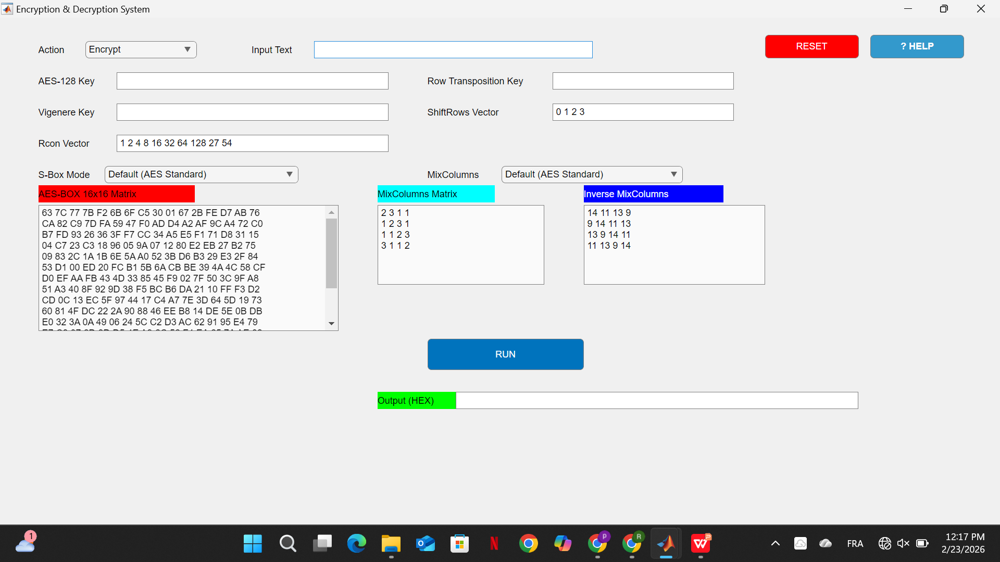

# Encryption and Decryption System (MATLAB)

This project is a robust cryptographic tool developed in MATLAB, combining multiple layers of security through both classical and modern encryption algorithms. It features a user-friendly graphical interface (App Designer) to manage keys and visualize transformation matrices.

## 🔐 Cryptographic Pipeline

The system uses a layered approach to ensure data integrity and confidentiality:

1.  **Row Transposition:** Permutes the input text based on a numeric key.
2.  **Vigenère Cipher:** Applies polyalphabetic substitution.
3.  **AES-128 (Simplified/Custom):**
    *   **Key Addition (XOR):** 128-bit key mixing.
    *   **Shift Rows:** Circular byte shifts.
    *   **S-Box Mode:** Non-linear byte substitution using a 16x16 matrix.
    *   **Mix Columns:** Linear transformation for diffusion.
    *   **Rcon:** Round constants for key scheduling.

## 📸 Dashboard Preview



## 🚀 Features

*   **Customizable Matrices:** Users can modify the S-Box, MixColumns, and Inverse MixColumns matrices directly in the UI.
*   **Hexadecimal Output:** Results are provided in both plain text and HEX format for technical verification.
*   **Dual Mode:** Seamless switching between Encryption and Decryption.

## 🛠 Requirements

*   **MATLAB R2020b or later** (required for `uifigure` and modern UI components).

## 📖 How to Run

1.  **Download** or clone this repository.
2.  Open **MATLAB**.
3.  Set your current folder to the project directory.
4.  Execute the app:
    ```matlab
    encryption_app
    ```

## 📝 Usage Notes

*   **AES Key:** Ensure you provide a 16-character (128-bit) key.
*   **Vigenère Key:** Use an alphabetic string (e.g., "SECRET").
*   **Row Transposition:** Provide a numeric sequence (e.g., "3 1 4 2").

## 📄 License

This project is licensed under the [MIT License](LICENSE).
